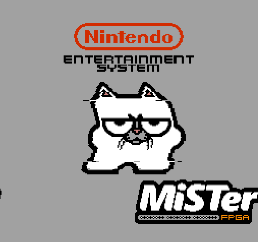
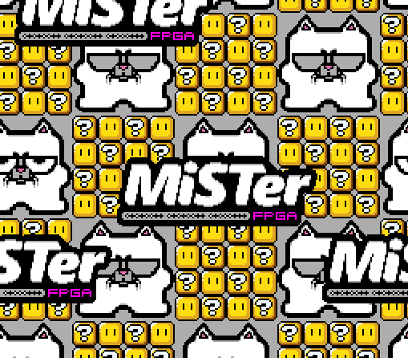
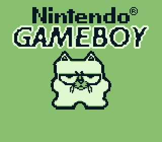
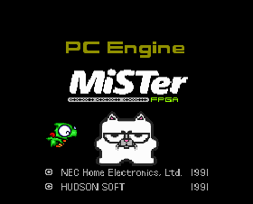
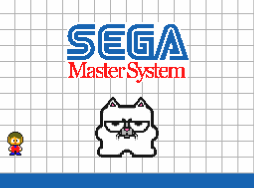

# mister-boot-roms
Custom boot roms for the MiSTer FPGA project.
The MiSTer fpga project has cores that offer an interesting feature where you can boot into a rom upon starting it.
This project offers custimized roms to make some of the cores more interesting and fun.
Note: These are not bios replacement but only roms that are launched when booting a core.

Once I have tackled all the cores that can auto boot roms, I will release the source code and build instructions for people that want to do remixes.

If you want to contribute now, feel free to contact me on twitter. twitter.com/uberyoji

For more information about MiSTer please refer to the official wiki page: https://github.com/MiSTer-devel/Main_MiSTer/wiki

## How to install the boot roms

### By using update_all to install the latest release
Add the following to the bottom of `/media/fat/downloader.ini` on your MiSTer:
```ini
[uberyoji_mister_boot_roms]
db_url = https://raw.githubusercontent.com/uberyoji/mister-boot-roms/main/db/uberyoji_mister_boot_roms.json
```
### By downloading a release zip and extracting manually
- Navigate to the tags section of this repo
- Download 'mister-boot-roms.zip'
- Extract it into your 'Games' folder (usually /media/fat/Games on your mister sd card)
## Available ROMS
So far only the following core roms are available.
| Core | Naming | Preview | Notes |
| :--: | :------: | :----: | :--- | 
| NES | boot1.rom |  | Keys<br/>> Select: Toggle rainbow on/off on logo<br/>> Left/Right: Change logo color<br/><br/>Last scene and options now saved to sram.  |
| SNES | boot.rom |  | |
| Nintendo Gameboy | boot2.rom |  | |
| NEC PC Engine | boot.rom |  | |
| Sega Master System | boot.rom |  | WIP (Issue with bios. Disable in menu to have it launch properly on core boot.) |
| Sega Genesis | boot.rom | | WIP |

#### Upcoming core roms:
- GBA (boot.rom) WIP. Unreleased since the boot support in MiSTer is not working :-/ See this: https://github.com/MiSTer-devel/GBA_MiSTer/issues/87

## TODO:
- Clean and upload source code.
- Add build steps for each roms.
- Brainstorm some ideas
- Add more variations, fx, interactivity

#### TODO: NES
- Add more scenes
- Add sram support to save scene config

#### TODO: SNES
- Add more scenes
- Add sram support to save scene config

#### TODO: Gameboy
- Add more scenes
- Add sram support to save scene config
 
#### TODO: PC Engine
- Add more scenes
- Add sram support to save scene config

#### TODO: SMS
- Add more scenes
- Add sram support to save scene config
- Fix issue with bios turned on
 

Feel free to contact me via the issues if you have comments, suggestions, feedback.
