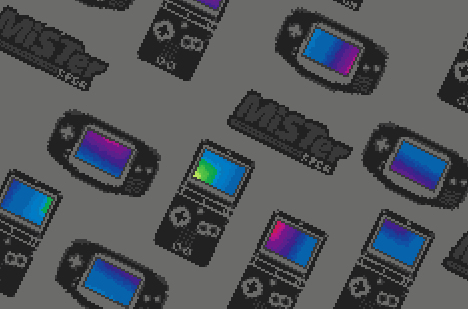
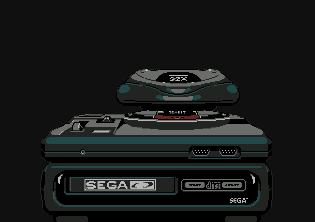

# mister-boot-roms
Custom boot roms for the MiSTer FPGA project.
The MiSTer fpga project has MGL file support that offer an interesting feature where you can boot into a rom upon starting it.
This project offers custimized roms to make some of the cores more interesting and fun.
Note: These are not bios replacement but only roms that are launched when booting a core thru MGL files.

Once I have tackled all the planned cores, I will release the source code and build instructions for people that want to do remixes.

If you want to contribute now, feel free to contact me on twitter. twitter.com/uberyoji

For more information about MiSTer please refer to the official wiki page: https://github.com/MiSTer-devel/Main_MiSTer/wiki

## How to install the boot roms

### By using update_all to install the latest release
Add the following to the bottom of `/media/fat/downloader.ini` on your MiSTer:
```ini
[uberyoji_mister_boot_roms_mgl]
db_url = https://raw.githubusercontent.com/uberyoji/mister-boot-roms/main/db/uberyoji_mister_boot_roms_mgl.json
```
### By downloading a release zip and extracting manually
- Navigate to the tags section of this repo
- Download 'mister-boot-roms-mgl.zip'
- Extract it into the root of your MiSTer folder (usually /media/fat on your sd card)
## Available ROMS
So far only the following core roms are available.
| Core | Preview |
| :--: | :------: |
| NES |  | 
| SNES |  | 
| GBA |  | 
| Nintendo Gameboy |  |  
| NEC PC Engine |  | 
| Sega Master System |  | 
| Sega Genesis |  | 
| Sega 32X |  |  
| PlayStation |  |  
| N64 | beta wip - Concept by [Dinierto Designs](https://t.co/YbKggNAU5R) |

#### Upcoming core roms:
- Saturn
- Color remixed version of Gameboy

## TODO:
- Clean and upload source code.
- Add build steps for each roms.
- Brainstorm some ideas
- Add more variations, fx, interactivity

#### TODO: Gameboy
- Add more scenes
- Add sram support to save scene config

#### TODO: SMS
- Add more scenes
- Add sram support to save scene config

#### TODO: 32X
- Save fire palette selection to SRAM
 

Feel free to contact me via the issues if you have comments, suggestions, feedback.
